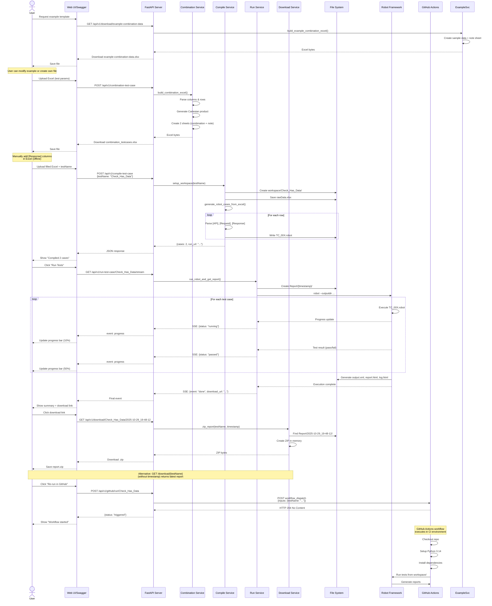
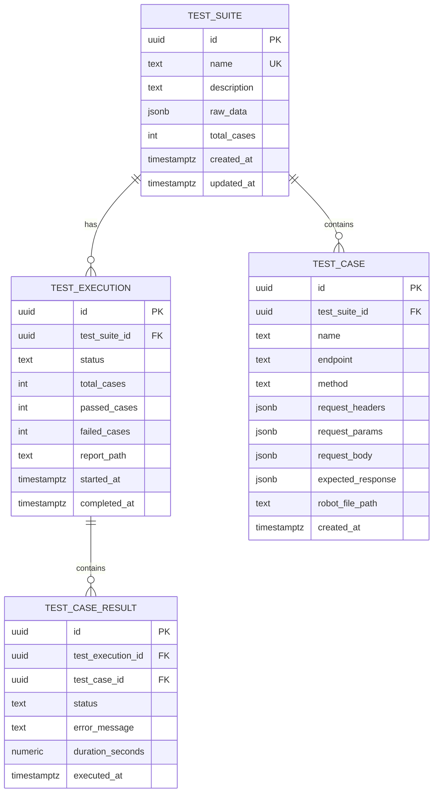

# 📋 Product Requirements Document (PRD)

## TestForge - Automated Combination Test Platform

**Version:** 1.0  
**Date:** October 29, 2025  
**Author:** Business Analyst & System Analyst  
**Status:** Draft

---

## 📌 Executive Summary

### Problem Statement
Quality Assurance teams face significant challenges when testing API endpoints with multiple parameter combinations. Manual creation of test cases for all possible combinations is:
- **Time-consuming:** Can take days to weeks for complex APIs
- **Error-prone:** Manual data entry leads to inconsistencies
- **Difficult to maintain:** Changes require updating hundreds of test cases
- **Hard to track:** No centralized view of test coverage and results

### Solution
**TestForge** is an automated test case generation and execution platform that transforms Excel/CSV input files into comprehensive Robot Framework test suites with real-time execution monitoring and GitHub Actions integration.

### Business Value
- ⏱️ **90% reduction** in test case creation time
- 🎯 **100% coverage** of parameter combinations
- 🔄 **Automated CI/CD integration** via GitHub Actions
- 📊 **Real-time visibility** through SSE streaming
- � **Enhanced debugging** with comprehensive request/response logging
- �📦 **Instant report generation** with downloadable artifacts

---

## 🎯 Problem Breakdown & Assumptions

### Key Requirements
1. **Test Case Generation**
   - Support CSV and XLSX file formats
   - Generate Cartesian product of all parameter combinations
   - Handle nested JSON structures (e.g., `profile.name`, `children[0].name`)
   - Support multiple data types (string, number, boolean)

2. **Test Compilation**
   - Convert Excel rows into Robot Framework `.robot` files
   - Preserve request structure (Headers, Params, Body)
   - Include expected response validation
   - Organize tests in isolated workspaces

3. **Test Execution**
   - Run Robot Framework tests asynchronously
   - Stream progress updates in real-time
   - Generate HTML/XML reports
   - Store results with timestamps

4. **Result Management**
   - Download test reports as ZIP files
   - Re-run tests via GitHub Actions
   - Maintain test history

### Unknowns & Risks
| Risk | Impact | Mitigation |
|------|--------|------------|
| Large combination sets causing performance issues | High | Implement pagination and limits on combination count |
| Robot Framework version compatibility | Medium | Lock to specific version (pin in requirements.txt) |
| Network timeouts during API calls | Medium | Configurable timeout settings per test |
| Excel file format variations | Low | Strict validation and error messages |

### Assumptions
1. Users have basic knowledge of API testing concepts
2. Test data is provided in the specified Excel format
3. Python 3.14.0 is available in the deployment environment
4. GitHub repository has Actions enabled
5. Tests target RESTful HTTP APIs

---

## 👥 User Personas & Stakeholders

### Primary Users

#### 1. QA Engineer (Automated Tester)
**Name:** Sarah Chen  
**Role:** Senior QA Automation Engineer  
**Goals:**
- Create comprehensive test coverage quickly
- Execute tests and monitor results in real-time
- Integrate tests into CI/CD pipeline

**Pain Points:**
- Manually writing hundreds of similar test cases
- Difficulty tracking which combinations have been tested
- Time lag between test execution and results

**How TestForge Helps:**
- Auto-generates all combinations from Excel
- Provides real-time SSE streaming of test progress
- One-click GitHub Actions integration

---

#### 2. Manual Tester (Test Case Designer)
**Name:** Michael Rodriguez  
**Role:** QA Test Analyst  
**Goals:**
- Design test scenarios covering edge cases
- Ensure all parameter combinations are tested
- Generate test documentation

**Pain Points:**
- Calculating all possible combinations manually
- Maintaining Excel sheets with hundreds of rows
- No automated validation of test case completeness

**How TestForge Helps:**
- Uploads simple Excel → gets all combinations auto-generated
- Clear note sheet explains how to add expected results
- Downloadable reports for documentation

---

### Secondary Stakeholders
- **DevOps Engineers:** Need CI/CD integration
- **Development Team:** Want fast feedback on API changes
- **Test Managers:** Require test coverage metrics and reports

---

## 🔄 User Journeys

### Journey 1: Generate Test Combinations

**Actor:** QA Test Analyst  
**Trigger:** Need to test an API with multiple parameter variations  
**Pre-conditions:** 
- User has API specification
- User knows test parameter values

**Main Flow:**

1. User prepares Excel file with columns:
   ```
   [API]endpoint, [API]Method, [Request][Header]x-api-key, 
   [Request][Params]id, [Request][Query]page, [Request][Query]status,
   [Request][Body]father, [Request][Body]profile.name, 
   [Request][Body]children[0].name
   ```

2. User fills in sample values:
   ```
   Row 1: xxx.com/read/{id}, POST, xxxasdf, 1, 1, PAID, true, best, god
   Row 2: (empty cells where needed), , , , 2, PENDING, , , kal
   ```

3. User opens Swagger UI at `http://localhost:3000/docs`

4. User navigates to `POST /api/v1/combination-test-case` endpoint

5. User uploads Excel file via file picker

6. System processes file and generates Cartesian product of all non-empty values per column

7. System creates Excel with 2 sheets:
   - **Sheet 1 (combination):** All test case combinations
   - **Sheet 2 (note):** Instructions for adding `[Response]` columns and operators

**Note Sheet Content:**
- Instructions for adding response validation columns
- Supported assertion operators: `eq` (default), `ne`, `gt`, `lt`, `contains`, `regex`, `between`
- Examples of dynamic assertions (e.g., `[Response][Body]age:gt` with value `18`)
- Query parameter usage (e.g., `[Request][Query]page`)

8. User downloads `combination_testcases.xlsx`

9. User opens file and reviews 2 generated combinations (god vs kal)

**Alternate Flow 1: Invalid File Format**
- Step 5a: User uploads CSV file
- System accepts and processes successfully

**Alternate Flow 2: Empty File**
- Step 5b: User uploads empty file
- System returns HTTP 400 with error message "empty file"

**Edge Cases:**
- Column with all empty values → treated as optional field (null)
- Special characters in values → preserved as-is
- Very large files (>10,000 rows) → may timeout (needs limit)

**Post-conditions:**
- Excel file with all combinations downloaded
- User ready to add expected `[Response]` columns

**Acceptance Criteria:**
```gherkin
Given a valid Excel file with test parameters
When user uploads via POST /api/v1/combination-test-case
Then system generates all possible combinations
And returns Excel with 2 sheets (combination + note)
And response time is < 10 seconds for up to 1000 combinations
```

---

### Journey 2: Compile Test Cases

**Actor:** QA Automation Engineer  
**Trigger:** Completed adding expected results to combination Excel  
**Pre-conditions:**
- User has filled Excel with `[Response]` columns
- User has decided on a test suite name

**Main Flow:**

1. User manually adds columns to combination sheet:
   - `[Response][API]status` (e.g., 200, 404, 500)
   - `[Response][Body]data.hasdata` (e.g., true/false)
   - `[Response][Body]data.user.name` (e.g., John)
   - `[Response][Body]age:gt[Type:int]` with value `18` (dynamic assertion with type: age > 18)
   - `[Response][Body]score:between[Type:float]` with value `50.5,80.9` (range check with float)
   - `[Response][Body]active[Type:bool]` with value `true` (boolean equality check)
   - `[Response][Header]x-token` (e.g., abc123)
   - (Any number of `[Response][Body]*` or `[Response][Header]*` columns with optional operators and types)

**Supported Assertion Operators:**
- `eq` (default) — Exact equality
- `ne` — Not equal
- `gt` — Greater than (numeric)
- `lt` — Less than (numeric)
- `contains` — Substring present
- `regex` — Regular expression match
- `between` — Numeric range; value format: `low,high` or `low:high` or `low;high`

**Supported Data Types:**
- `[Type:int]` — Integer
- `[Type:float]` — Float/Double
- `[Type:bool]` — Boolean
- `[Type:string]` — String (default)

2. User can also add query parameters for filtering/pagination:
   - `[Request][Query]page` (e.g., 1)
   - `[Request][Query]status` (e.g., PAID)
   - `[Request][Query]sort` (e.g., -created_at)

3. User saves Excel file locally

3. User navigates to `POST /api/v1/compile-test-case` in Swagger UI

4. User enters JSON body:
   ```json
   {
     "testName": "Check_Has_Data"
   }
   ```

5. User uploads filled Excel file

6. System creates folder structure:
   ```
   workspace/Check_Has_Data/
   ├── rawData.xlsx
   ├── generated/
   └── Report/
   ```

7. System parses Excel and reads all rows

8. For each row, system:
   - Extracts `[API]endpoint`, `[API]Method`
   - **Auto-detects base URL** from first endpoint (e.g., `http://mockoon.ariyanaragroup.com`)
   - **Converts full URL to relative path** (e.g., `/api/v1/public/home`)
   - Groups `[Request][Header]*` into headers object
   - Groups `[Request][Params]*` into params object (reserved for future path params)
   - Groups `[Request][Query]*` into query parameters (e.g., `?page=1&status=PAID`)
   - Parses `[Request][Body]*` into nested JSON (supports `.` and `[n]`)
   - Extracts `[Response][API]status` for status code validation
   - Extracts `[Response][Body]*` columns for response body validation with dynamic operators:
     - Default operator: `eq` (equality)
     - Optional operators: `:gt`, `:lt`, `:ne`, `:contains`, `:regex`, `:between`
     - Optional data types: `[Type:int]`, `[Type:float]`, `[Type:bool]`, `[Type:string]`
     - Supports JSON path with operator and type (e.g., `age:gt[Type:int]` → checks `age > expected_value` as integer)
   - Extracts `[Response][Header]*` columns for response header validation

9. System generates `.robot` file per test case in `generated/` folder:
   ```robot
   *** Settings ***
   Library    RequestsLibrary
   Library    JSONLibrary
   Library    Collections
   Suite Setup    Create Session    api    http://mockoon.ariyanaragroup.com

   *** Test Cases ***
   TC_001_Check_Has_Data
       Log    ========== REQUEST ==========    console=yes
       Log    Method: POST    console=yes
       Log    Endpoint: /api/v1/read/1    console=yes
       ${query}=    Create Dictionary    page=1    status=PAID
       Log    Query: ${query}    console=yes
       ${headers}=    Create Dictionary    x-api-key=xxxasdf
       Log    Headers: ${headers}    console=yes
       ${payload}=    Create Dictionary    father=true    profile={"name": "best"}    children=[{"name": "god"}]
       Log    Body: ${payload}    console=yes
       ${resp}=    POST On Session    api    /api/v1/read/1    params=${query}    headers=${headers}    json=${payload}    expected_status=any
       Log    ========== RESPONSE ==========    console=yes
       Log    Status Code: ${resp.status_code}    console=yes
       Log    Response Headers: ${resp.headers}    console=yes
       Log    Response Body: ${resp.text}    console=yes
       Should Be Equal As Integers    ${resp.status_code}    200
       Should Be Equal    ${resp.headers['x-token']}    abc123
       ${json}=    Set Variable    ${resp.json()}
       ${value}=    Get Value From Json    ${json}    $.data.hasdata
       Should Be Equal    ${value[0]}    true
   ```

10. System returns JSON response:
    ```json
    {
      "status": "compiled",
      "testName": "Check_Has_Data",
      "cases": 2,
      "run_url": "/api/v1/run-test-case/Check_Has_Data/stream"
    }
    ```

**Special Feature: `expected_status=any` Parameter**

To ensure tests can properly validate **all HTTP status codes** (including error codes like 400, 404, 500), the compile service automatically adds `expected_status=any` to every generated HTTP request keyword.

**Why this is important:**
- By default, RequestsLibrary raises an `HTTPError` exception when the API returns status codes >= 400
- This would cause tests expecting error codes (e.g., testing negative scenarios) to **fail before reaching the assertion**
- Adding `expected_status=any` tells RequestsLibrary to accept **any status code** without raising an exception
- The test can then validate the actual status code using `Should Be Equal As Integers`

**Example - Testing Expected Error Response:**
```robot
*** Test Cases ***
TC_044_Invalid_Field_Values
    ${headers}=    Create Dictionary    x-mock-status=400
    ${payload}=    Create Dictionary    Gender=Female    Age=18-30
    # expected_status=any allows the request to complete without raising HTTPError on 400 status
    ${resp}=    POST On Session    api    /api/combination-data    headers=${headers}    json=${payload}    expected_status=any
    # Now we can properly validate that we received the expected 400 status code
    Should Be Equal As Integers    ${resp.status_code}    400
```

**Without `expected_status=any`:**
```robot
${resp}=    POST On Session    api    /api/combination-data    headers=${headers}    json=${payload}
# ❌ Test fails here with HTTPError: 400 Client Error - never reaches assertion
Should Be Equal As Integers    ${resp.status_code}    400
```

**With `expected_status=any`:**
```robot
${resp}=    POST On Session    api    /api/combination-data    headers=${headers}    json=${payload}    expected_status=any
# ✅ Request completes, test can validate the status code
Should Be Equal As Integers    ${resp.status_code}    400
```

This ensures **comprehensive test coverage** for both success (2xx) and error (4xx/5xx) scenarios.

**Alternate Flow 1: Invalid Excel Structure**
- Step 7a: Excel missing required `[API]endpoint` column
- System returns HTTP 400 with error "Missing required column: [API]endpoint"

**Alternate Flow 2: Test Name Already Exists**
- Step 6a: Folder `workspace/Check_Has_Data/` already exists
- System overwrites `rawData.xlsx` and regenerates all `.robot` files
- User is not warned (idempotent behavior)

**Edge Cases:**
- Very long test names (>255 chars) → truncate with hash
- Special characters in testName → sanitize to alphanumeric + underscore
- Malformed JSON in `[Request][Body]` → return validation error

**Post-conditions:**
- Workspace folder created with rawData.xlsx
- All `.robot` files generated
- System ready to run tests

**Acceptance Criteria:**
```gherkin
Given a valid filled Excel file with [Response] columns
And a unique testName "Check_Has_Data"
When user uploads via POST /api/v1/compile-test-case
Then system creates workspace/Check_Has_Data/ folder
And saves rawData.xlsx
And generates N .robot files where N = row count
And returns run_url for next step
And response time is < 5 seconds for 100 test cases
```

---

### Journey 3: Run Tests with Real-Time Monitoring

**Actor:** QA Automation Engineer  
**Trigger:** Test cases compiled and ready to execute  
**Pre-conditions:**
- Workspace folder exists with `.robot` files
- Robot Framework dependencies installed

**Main Flow:**

1. User clicks on `run_url` from compile response: `/api/v1/run-test-case/Check_Has_Data/stream`

2. Frontend establishes EventSource connection:
   ```javascript
   const eventSource = new EventSource('/api/v1/run-test-case/Check_Has_Data/stream');
   ```

3. System validates workspace exists and has `.robot` files in `generated/`

4. System creates timestamped report folder:
   ```
   workspace/Check_Has_Data/Report/2025-10-29_19-48-12/
   ```

5. System executes Robot Framework:
   ```bash
   robot --outputdir workspace/Check_Has_Data/Report/2025-10-29_19-48-12 \
         workspace/Check_Has_Data/generated/
   ```

6. System streams SSE events every ~0.5 seconds:

   **Event 1 (Test Starting):**
   ```
   event: progress
   data: {"case": "TC_001.robot", "status": "running", "progress": 10}
   ```

   **Event 2 (Test Passed):**
   ```
   event: progress
   data: {"case": "TC_001.robot", "status": "passed", "progress": 50}
   ```

   **Event 3 (Test Failed):**
   ```
   event: progress
   data: {"case": "TC_002.robot", "status": "failed", "error": "Expected true, got false", "progress": 100}
   ```

   **Final Event (Completion):**
   ```
   event: done
   data: {
     "summary": {"total": 2, "passed": 1, "failed": 1},
     "download_url": "http://localhost:3000/api/v1/download/Check_Has_Data/2025-10-29_19-48-12"
   }
   ```

7. Robot Framework generates report files:
   - `output.xml` (machine-readable)
   - `report.html` (summary report)
   - `log.html` (detailed execution log)

8. System closes SSE stream

9. User sees final summary and download link

**Alternate Flow 1: No Tests Found**
- Step 3a: `generated/` folder is empty or contains no `.robot` files
- System returns HTTP 404 with error "no generated tests found"

**Alternate Flow 2: Test Execution Timeout**
- Step 5a: Robot execution takes > 30 minutes
- System sends timeout event and kills process
- User receives partial results

**Edge Cases:**
- Network interruption during SSE stream → client auto-reconnects (if supported)
- Multiple simultaneous runs of same testName → creates separate timestamped reports
- Robot Framework crashes → system sends error event

**Post-conditions:**
- Report folder created with timestamp
- HTML/XML reports generated
- User has download URL

**Acceptance Criteria:**
```gherkin
Given compiled test suite "Check_Has_Data"
When user connects to GET /api/v1/run-test-case/Check_Has_Data/stream
Then system executes all .robot files
And streams SSE events every 0.5 seconds with progress
And final event contains full absolute download_url
And final event contains summary {total, passed, failed}
And all reports are saved in timestamped folder
And SSE connection closes after completion
```

---

### Journey 4: Download Test Report

**Actor:** QA Engineer  
**Trigger:** Tests completed, wants to download results  
**Pre-conditions:**
- At least one test execution completed
- Report folder exists with timestamp

**Main Flow:**

1. User receives download URL from SSE final event:
   ```
   http://localhost:3000/api/v1/download/Check_Has_Data/2025-10-29_19-48-12
   ```

2. User clicks URL or makes GET request

3. System validates timestamp format (if provided)

4. System finds report folder:
   - **If timestamp provided:** `workspace/Check_Has_Data/Report/2025-10-29_19-48-12/`
   - **If timestamp omitted:** Latest folder in `workspace/Check_Has_Data/Report/` (sorted by name descending)

5. System creates in-memory ZIP file containing:
   - `output.xml`
   - `report.html`
   - `log.html`
   - Any screenshots or artifacts

6. System sets response headers:
   ```
   Content-Type: application/zip
   Content-Disposition: attachment; filename="Check_Has_Data_Report_2025-10-29_19-48-12.zip"
   ```

7. System streams ZIP file to client

8. Browser downloads file

9. User extracts and opens `report.html` in browser

**Alternate Flow 1: No Reports Exist**
- Step 4a: No Report folder found
- System returns HTTP 404 with error "No reports found for Check_Has_Data"

**Alternate Flow 2: Specific Timestamp Not Found**
- Step 4b: User provides timestamp `2025-10-29_18-00-00` but folder doesn't exist
- System returns HTTP 404 with error "Report with timestamp 2025-10-29_18-00-00 not found"

**Alternate Flow 3: Download Latest (No Timestamp)**
- Step 1a: User navigates to `/api/v1/download/Check_Has_Data` (without timestamp)
- Step 4c: System lists all folders in `Report/` directory
- System sorts by folder name (descending) and selects first (latest)
- Continue to step 5

**Alternate Flow 4: Invalid Timestamp Format**
- Step 3a: User provides malformed timestamp `2025-10-29-invalid`
- System returns HTTP 400 with error "Timestamp must be in format YYYY-MM-DD_HH-MM-SS"

**Edge Cases:**
- Very large reports (>100MB) → may be slow, consider streaming optimization
- Concurrent download requests → each creates independent ZIP stream (no conflicts)
- Missing files in report folder → ZIP only existing files (partial download)
- Timestamp with special characters → validate against pattern `^\d{4}-\d{2}-\d{2}_\d{2}-\d{2}-\d{2}$`
- Multiple reports with same timestamp (unlikely but possible) → return first match

**Post-conditions:**
- ZIP file downloaded to user's machine
- Reports viewable offline
- No server-side state changed

**Acceptance Criteria:**
```gherkin
# Scenario 1: Download Specific Report
Given test suite "Check_Has_Data" has completed execution at "2025-10-29_19-48-12"
When user requests GET /api/v1/download/Check_Has_Data/2025-10-29_19-48-12
Then system finds exact Report/2025-10-29_19-48-12/ folder
And creates ZIP file with all report artifacts from that folder
And returns download with proper Content-Disposition header
And filename is "Check_Has_Data_Report_2025-10-29_19-48-12.zip"
And download completes successfully within 30 seconds

# Scenario 2: Download Latest Report (No Timestamp)
Given test suite "Check_Has_Data" has multiple executions
And latest execution was at "2025-10-29_20-15-30"
When user requests GET /api/v1/download/Check_Has_Data
Then system finds latest Report/{timestamp}/ folder by sorting descending
And creates ZIP file with all report artifacts from latest folder
And returns download with proper Content-Disposition header
And filename includes testName and latest timestamp
And download completes successfully within 30 seconds

# Scenario 3: Timestamp Not Found
Given test suite "Check_Has_Data" exists
When user requests GET /api/v1/download/Check_Has_Data/2025-10-29_99-99-99
Then system returns HTTP 404
And error message is "Report with timestamp 2025-10-29_99-99-99 not found"

# Scenario 4: Invalid Timestamp Format
Given test suite "Check_Has_Data" exists
When user requests GET /api/v1/download/Check_Has_Data/invalid-timestamp
Then system returns HTTP 400
And error message is "Timestamp must be in format YYYY-MM-DD_HH-MM-SS"
```

---

### Journey 5: Re-run Tests via GitHub Actions

**Actor:** DevOps Engineer  
**Trigger:** Need to re-run tests after code deployment  
**Pre-conditions:**
- GitHub repository configured with Actions
- `GITHUB_TOKEN` environment variable set
- Workflow file `.github/workflows/run-test.yml` exists

**Main Flow:**

1. User makes POST request (via API or dashboard):
   ```
   POST /api/v1/github/run/Check_Has_Data
   ```

2. System reads environment variables:
   ```python
   GITHUB_REPOSITORY = "owner/TestForge"
   GITHUB_TOKEN = "ghp_xxxxxxxxxxxx"
   ```

3. System constructs GitHub API request:
   ```
   POST https://api.github.com/repos/owner/TestForge/actions/workflows/run-test.yml/dispatches
   ```

4. System sends payload:
   ```json
   {
     "ref": "main",
     "inputs": {
       "testName": "Check_Has_Data"
     }
   }
   ```

5. GitHub API responds with HTTP 204 (No Content)

6. GitHub Actions triggers workflow

7. Workflow executes in Ubuntu runner:
   - Checks out repository
   - Sets up Python 3.14.0
   - Installs dependencies
   - Runs Robot Framework tests from `workspace/Check_Has_Data/generated/`
   - Generates reports in `workspace/Check_Has_Data/Report/{timestamp}/`

8. System returns JSON response:
   ```json
   {
     "status": "triggered",
     "testName": "Check_Has_Data",
     "workflow": "run-test.yml"
   }
   ```

9. User can view workflow run in GitHub Actions tab

**Alternate Flow 1: Invalid GitHub Token**
- Step 5a: GitHub API returns HTTP 401 Unauthorized
- System returns HTTP 500 with error "Failed (401): Bad credentials"

**Alternate Flow 2: Workflow Not Found**
- Step 5b: GitHub API returns HTTP 404
- System returns HTTP 500 with error "Workflow run-test.yml not found"

**Edge Cases:**
- `testName` doesn't exist in workspace → GitHub workflow starts but finds no tests
- GitHub Actions quota exceeded → API returns 403
- Network timeout to GitHub API → retry logic needed

**Post-conditions:**
- GitHub Actions workflow triggered
- Workflow run ID available in GitHub UI
- Test results will be available in repository after completion

**Acceptance Criteria:**
```gherkin
Given GitHub repository with Actions enabled
And valid GITHUB_TOKEN in environment
And workflow file run-test.yml exists
When user requests POST /api/v1/github/run/Check_Has_Data
Then system calls GitHub API workflow_dispatch
And GitHub Actions workflow starts with input testName
And system returns status "triggered"
And response time is < 5 seconds
```

---

## 📡 API Specification

### Design Principles
- RESTful architecture with resource-based URLs
- Semantic HTTP status codes
- JSON for structured responses
- Multipart/form-data for file uploads
- Server-Sent Events (SSE) for real-time streaming
- Idempotency for POST operations
- Versioned endpoints (`/api/v1/...`)

---

### Special Value Handling (Sentinel Keywords)

#### Overview
TestForge supports sentinel keywords for comprehensive edge case and boundary testing. These keywords enable testers to explicitly specify null values, empty strings, empty arrays, and empty objects in their test data.

#### Motivation
**Problem:** Traditional CSV/Excel input cannot distinguish between:
- Empty string (`""`)
- JSON null (`null`)
- Empty array (`[]`)
- Empty object (`{}`)
- Omitted field (not sent in request)

**Solution:** Use special keywords that the system recognizes and converts appropriately.

#### Supported Sentinel Keywords

| Keyword | Generated Value | Robot Framework | JSON Output | Use Case |
|---------|----------------|-----------------|-------------|----------|
| `[EMPTY]` or `[EMPTY_STRING]` | `""` | `${EMPTY}` | `{"field": ""}` | Test empty string validation |
| `[NULL]` | `None` | `${None}` | `{"field": null}` | Test null value handling |
| `[EMPTY_ARRAY]` | `[]` | `@{EMPTY}` | `{"field": []}` | Test empty array handling |
| `[EMPTY_OBJECT]` | `{}` | `&{EMPTY}` | `{"field": {}}` | Test empty object handling |
| (blank cell) | Field omitted | Not included | `{}` | Field not sent at all |

#### Request Body Examples

**Excel Input:**
```
| [Request][Body]name | [Request][Body]email | [Request][Body]age | [Request][Body]tags | [Request][Body]meta |
|---------------------|---------------------|-------------------|---------------------|---------------------|
| [EMPTY]             | user@test.com       | [NULL]            | [EMPTY_ARRAY]       | [EMPTY_OBJECT]      |
| John Doe            |                     | 25                |                     |                     |
```

**Generated Test Case 1 (Robot Framework):**
```robot
*** Test Cases ***
TC_001
    ${payload}=    Create Dictionary    name=${EMPTY}    email=user@test.com    age=${None}    tags=@{EMPTY}    meta=&{EMPTY}
    ${resp}=    POST On Session    api    /users    json=${payload}    expected_status=any
```

**Generated JSON Request 1:**
```json
{
  "name": "",
  "email": "user@test.com",
  "age": null,
  "tags": [],
  "meta": {}
}
```

**Generated Test Case 2 (Robot Framework):**
```robot
*** Test Cases ***
TC_002
    ${payload}=    Create Dictionary    name=John Doe    age=25
    ${resp}=    POST On Session    api    /users    json=${payload}    expected_status=any
```

**Generated JSON Request 2:**
```json
{
  "name": "John Doe",
  "age": 25
}
```
→ Note: `email`, `tags`, `meta` omitted (blank cells)

#### Response Validation with Type Operators

TestForge provides type and structure validation operators for response assertions:

**Type Validation Operators:**

| Operator | Description | Example Usage |
|----------|-------------|---------------|
| `:is_null` | Field value is `null` | `[Response][Body]error:is_null` with value `true` |
| `:is_not_null` | Field value is not `null` | `[Response][Body]data:is_not_null` with value `true` |
| `:is_empty` | String/array/object is empty | `[Response][Body]items:is_empty` with value `true` |
| `:is_not_empty` | String/array/object is not empty | `[Response][Body]name:is_not_empty` with value `true` |
| `:is_array` | Field is JSON array | `[Response][Body]tags:is_array` with value `true` |
| `:is_object` | Field is JSON object | `[Response][Body]meta:is_object` with value `true` |
| `:is_string` | Field is string type | `[Response][Body]name:is_string` with value `true` |
| `:is_number` | Field is number type | `[Response][Body]age:is_number` with value `true` |
| `:is_bool` | Field is boolean type | `[Response][Body]active:is_bool` with value `true` |

**Response Validation Examples:**

**Excel Input:**
```
| [Response][Body]error:is_null | [Response][Body]items:is_empty | [Response][Body]data.user:is_not_null | [Response][Body]tags:is_array |
|-------------------------------|-------------------------------|---------------------------------------|------------------------------|
| true                          | true                          | true                                  | true                         |
```

**Generated Robot Framework Assertions:**
```robot
# Validate error is null
${value}=    Get Value From Json    ${json}    $.error
Should Be Equal    ${value[0]}    ${None}

# Validate items is empty
${value}=    Get Value From Json    ${json}    $.items
Should Be Empty    ${value[0]}

# Validate data.user is not null
${value}=    Get Value From Json    ${json}    $.data.user
Should Not Be Equal    ${value[0]}    ${None}

# Validate tags is array
${value}=    Get Value From Json    ${json}    $.tags
Should Be True    isinstance(${value[0]}, list)
```

#### Nested Null Values

**Excel Input:**
```
| [Request][Body]user.name | [Request][Body]user.address.street | [Request][Body]user.address.city |
|--------------------------|-------------------------------------|----------------------------------|
| John                     | [NULL]                              | Bangkok                          |
```

**Generated JSON:**
```json
{
  "user": {
    "name": "John",
    "address": {
      "street": null,
      "city": "Bangkok"
    }
  }
}
```

#### Validation Rules

**Data Processing:**
1. Sentinel keywords are case-insensitive: `[NULL]` = `[null]` = `[Null]`
2. Keywords must be exact match (no partial matching)
3. Processing order:
   - Detect sentinel keyword → convert to special value
   - If blank cell → return `None` (omit field)
   - Otherwise → apply normal type conversion

**Robot Framework Generation:**
- Empty string → `${EMPTY}`
- Null → `${None}`
- Empty array → `@{EMPTY}`
- Empty object → `&{EMPTY}`
- Omitted field → not included in `Create Dictionary`

**Response Validation:**
- Type operators (`:is_null`, `:is_empty`, etc.) expect boolean value (`true`/`false`)
- `is_empty` works for strings, arrays, and objects
- Type checks use Python's `isinstance()` function

#### Acceptance Criteria

```gherkin
# Scenario 1: Send Empty String
Given Excel cell [Request][Body]name contains "[EMPTY]"
When system compiles test case
Then Robot file contains "name=${EMPTY}"
And generated JSON request contains {"name": ""}

# Scenario 2: Send Null Value
Given Excel cell [Request][Body]age contains "[NULL]"
When system compiles test case
Then Robot file contains "age=${None}"
And generated JSON request contains {"age": null}

# Scenario 3: Send Empty Array
Given Excel cell [Request][Body]tags contains "[EMPTY_ARRAY]"
When system compiles test case
Then Robot file contains "tags=@{EMPTY}"
And generated JSON request contains {"tags": []}

# Scenario 4: Omit Field
Given Excel cell [Request][Body]email is blank
When system compiles test case
Then Robot file does NOT include "email" in Create Dictionary
And generated JSON request does NOT contain "email" field

# Scenario 5: Validate Null Response
Given Excel cell [Response][Body]error:is_null contains "true"
When system compiles test case
Then Robot file contains "Should Be Equal    ${value[0]}    ${None}"

# Scenario 6: Validate Empty Array
Given Excel cell [Response][Body]items:is_empty contains "true"
When system compiles test case
Then Robot file contains "Should Be Empty    ${value[0]}"

# Scenario 7: Validate Type is Array
Given Excel cell [Response][Body]tags:is_array contains "true"
When system compiles test case
Then Robot file contains "Should Be True    isinstance(${value[0]}, list)"
```

---

### 0. Download Example Template

#### Endpoint
```
GET /api/v1/download/example-combination-data
```

#### Description
Download example Excel template with sample test data and comprehensive prefix documentation. This helps users understand the expected file format and all available prefix types.

#### Authentication
None (can add Bearer token in production)

#### Request

**Example (cURL):**
```bash
curl -OJ http://localhost:3000/api/v1/download/example-combination-data
```

**Example (JavaScript):**
```javascript
window.location.href = '/api/v1/download/example-combination-data';
```

#### Response

**Success (200 OK):**
```
Content-Type: application/vnd.openxmlformats-officedocument.spreadsheetml.sheet
Content-Disposition: attachment; filename="example-combination-data.xlsx"

<Binary Excel file>
```

**Excel Structure:**

*Sheet 1: combination-data (Sample Data)*
| [API]endpoint | [API]Method | [Request][Header]x-api-key | [Request][Query]status | [Request][Query]page | [Request][Body]username | [Request][Body]profile.name |
|---------------|-------------|---------------------------|----------------------|---------------------|------------------------|---------------------------|
| https://api.example.com/users/{id} | GET | key123 | ACTIVE | 1 | | |
| https://api.example.com/users/{id} | POST | | INACTIVE | 2 | john_doe | John Doe |

*Sheet 2: note (Prefix Documentation)*
| Category | Prefix Format | Example | Sample Value | Description |
|----------|---------------|---------|--------------|-------------|
| API Configuration | [API]endpoint | https://api.example.com/users/{id} | ... | API endpoint URL |
| API Configuration | [API]Method | POST | POST / GET / PUT / DELETE | HTTP method |
| Request - Headers | [Request][Header]<header-name> | x-api-key | abc123xyz | Custom request header |
| Request - Query Parameters | [Request][Query]<query-name> | page | 1 | Query parameter |
| Request - Body | [Request][Body]<field-name> | username | john_doe | Simple field |
| Request - Body (Nested) | [Request][Body]<parent>.<child> | profile.name | John Doe | Nested object field |
| Response Validation | [Response][API]status | 200 | 200 / 201 / 400 / 404 | Expected status code |
| Response Validation | [Response][Body]<json-path> | data.hasdata | true | Expected response value |
| ... | ... | ... | ... | ... |

**Use Cases:**
1. **First-time users** - Download to see expected format and learn about prefixes
2. **Quick start** - Modify sample data instead of creating from scratch
3. **Reference** - Check prefix syntax while building test cases
4. **Training** - Use as teaching material for team onboarding

**Acceptance Criteria:**
```gherkin
Given user needs example template
When user requests GET /api/v1/download/example-combination-data
Then system returns Excel file with 2 sheets
And sheet 1 contains sample test data (2 rows minimum)
And sheet 2 contains complete prefix documentation
And file downloads with filename "example-combination-data.xlsx"
And response time is < 2 seconds
```

---

### 1. Generate Test Combinations

#### Endpoint
```
POST /api/v1/combination-test-case
```

#### Description
Upload CSV or Excel file to generate all possible test case combinations using Cartesian product algorithm.

#### Authentication
None (can add Bearer token in production)

#### Rate Limit
10 requests per minute per IP

#### Request

**Headers:**
```
Content-Type: multipart/form-data
```

**Form Fields:**
| Field | Type | Required | Description |
|-------|------|----------|-------------|
| `file` | File | Yes | CSV or XLSX file with test parameters |

**Example (cURL):**
```bash
curl -X POST http://localhost:3000/api/v1/combination-test-case \
  -F "file=@test_input.xlsx"
```

#### Response

**Success (200 OK):**
```
Content-Type: application/vnd.openxmlformats-officedocument.spreadsheetml.sheet
Content-Disposition: attachment; filename="combination_testcases.xlsx"

<Binary Excel file>
```

**Excel Structure:**

*Sheet 1: combination*
| [API]endpoint | [API]Method | [Request][Header]x-api-key | [Request][Params]id | [Request][Body]father | ... |
|---------------|-------------|---------------------------|--------------------|--------------------|-----|
| xxx.com/read/{id} | POST | xxxasdf | 1 | true | ... |
| xxx.com/read/{id} | POST | xxxasdf | 1 | true | ... |

*Sheet 2: note*
| Instructions |
|--------------|
| After generating the combination sheet, please manually add `[Response]` columns to define expected results (e.g., `[Response][Body]data.hasdata`, `[Response][Header]x-token`). |

**Error Responses:**

```json
// 400 Bad Request - Empty file
{
  "error": {
    "code": "EMPTY_FILE",
    "message": "empty file",
    "request_id": "req_abc123"
  }
}

// 400 Bad Request - Invalid format
{
  "error": {
    "code": "INVALID_FILE_FORMAT",
    "message": "Only CSV/XLSX files are supported",
    "request_id": "req_abc123"
  }
}

// 413 Payload Too Large
{
  "error": {
    "code": "FILE_TOO_LARGE",
    "message": "File size exceeds 10MB limit",
    "request_id": "req_abc123"
  }
}

// 500 Internal Server Error
{
  "error": {
    "code": "PROCESSING_ERROR",
    "message": "process error: <details>",
    "request_id": "req_abc123"
  }
}
```

#### Error Handling
- Invalid file extension → HTTP 400
- File size > 10MB → HTTP 413
- Parsing errors → HTTP 500 with details
- Empty columns → Generate with null values

---

### 2. Compile Test Cases

#### Endpoint
```
POST /api/v1/compile-test-case
```

#### Description
Upload filled Excel file with expected results to generate Robot Framework test scripts.

#### Authentication
None (can add Bearer token in production)

#### Request

**Headers:**
```
Content-Type: multipart/form-data
```

**Form Fields:**
| Field | Type | Required | Description | Validation |
|-------|------|----------|-------------|------------|
| `testName` | String | Yes | Unique test suite name | Alphanumeric + underscore, max 100 chars |
| `file` | File | Yes | Excel file with [Response] columns | XLSX format |

**Example (cURL):**
```bash
curl -X POST http://localhost:3000/api/v1/compile-test-case \
  -F "testName=Check_Has_Data" \
  -F "file=@combination_filled.xlsx"
```

**Example (JavaScript):**
```javascript
const formData = new FormData();
formData.append('testName', 'Check_Has_Data');
formData.append('file', fileInput.files[0]);

fetch('/api/v1/compile-test-case', {
  method: 'POST',
  body: formData
}).then(res => res.json());
```

#### Response

**Success (201 Created):**
```json
{
  "status": "compiled",
  "testName": "Check_Has_Data",
  "cases": 2,
  "run_url": "/api/v1/run-test-case/Check_Has_Data/stream"
}
```

**Error Responses:**

```json
// 400 Bad Request - Empty file
{
  "error": {
    "code": "EMPTY_FILE",
    "message": "empty file",
    "request_id": "req_def456"
  }
}

// 400 Bad Request - Invalid testName
{
  "error": {
    "code": "INVALID_TEST_NAME",
    "message": "testName must be alphanumeric with underscores only",
    "details": [{"field": "testName", "rule": "pattern:[a-zA-Z0-9_]+"}],
    "request_id": "req_def456"
  }
}

// 500 Internal Server Error
{
  "error": {
    "code": "COMPILATION_ERROR",
    "message": "compile error: Missing required column [API]endpoint",
    "request_id": "req_def456"
  }
}
```

#### Side Effects
- Creates `workspace/{testName}/` folder
- Saves `rawData.xlsx`
- Generates `.robot` files in `generated/` subfolder
- Overwrites existing files if testName already exists

---

### 3. Run Tests (SSE Stream)

#### Endpoint
```
GET /api/v1/run-test-case/{testName}/stream
```

#### Description
Execute Robot Framework tests and stream real-time progress via Server-Sent Events (SSE).

#### Authentication
None (can add Bearer token in production)

#### Parameters
| Name | Type | Location | Required | Description |
|------|------|----------|----------|-------------|
| `testName` | String | Path | Yes | Test suite name to execute |

#### Request

**Example (cURL):**
```bash
curl -N http://localhost:3000/api/v1/run-test-case/Check_Has_Data/stream
```

**Example (JavaScript):**
```javascript
const eventSource = new EventSource('/api/v1/run-test-case/Check_Has_Data/stream');

eventSource.addEventListener('progress', (e) => {
  const data = JSON.parse(e.data);
  console.log(`${data.case}: ${data.status} (${data.progress}%)`);
});

eventSource.addEventListener('done', (e) => {
  const data = JSON.parse(e.data);
  console.log('Summary:', data.summary);
  console.log('Download:', data.download_url);
  eventSource.close();
});

eventSource.onerror = (err) => {
  console.error('SSE error:', err);
  eventSource.close();
};
```

#### Response

**Success (200 OK):**
```
Content-Type: text/event-stream
Cache-Control: no-cache
Connection: keep-alive
```

**SSE Event Stream:**

```
event: progress
data: {"case": "TC_001.robot", "status": "running", "progress": 10}

event: progress
data: {"case": "TC_001.robot", "status": "passed", "progress": 50}

event: progress
data: {"case": "TC_002.robot", "status": "running", "progress": 60}

event: progress
data: {"case": "TC_002.robot", "status": "failed", "error": "Expected true, got false", "progress": 100}

event: done
data: {"summary": {"total": 2, "passed": 1, "failed": 1}, "download_url": "http://localhost:3000/api/v1/download/Check_Has_Data/2025-10-29_19-48-12"}
```

**Event Types:**

| Event | Fields | Description |
|-------|--------|-------------|
| `progress` | `case`, `status`, `progress`, `error?` | Individual test case progress |
| `done` | `summary`, `download_url` | Final summary with download link |

**Status Values:**
- `running` - Test case currently executing
- `passed` - Test case completed successfully
- `failed` - Test case failed with error

**Error Responses:**

```json
// 404 Not Found
{
  "error": {
    "code": "TESTS_NOT_FOUND",
    "message": "no generated tests found",
    "request_id": "req_ghi789"
  }
}
```

#### Side Effects
- Creates timestamped report folder: `workspace/{testName}/Report/{timestamp}/`
- Generates `output.xml`, `report.html`, `log.html`
- Executes all `.robot` files in `generated/` folder

---

### 4. Download Report

#### Endpoint
```
GET /api/v1/download/{testName}/{timestamp}
GET /api/v1/download/{testName}
```

#### Description
Download test execution report as a ZIP file. If timestamp is provided, downloads that specific report. If omitted, downloads the latest report.

#### Authentication
None (can add Bearer token in production)

#### Parameters
| Name | Type | Location | Required | Description |
|------|------|----------|----------|-------------|
| `testName` | String | Path | Yes | Test suite name |
| `timestamp` | String | Path | No | Report timestamp (format: `YYYY-MM-DD_HH-MM-SS`). If omitted, returns latest report |

#### Request

**Example 1 - Download Specific Report (cURL):**
```bash
curl -OJ http://localhost:3000/api/v1/download/Check_Has_Data/2025-10-29_19-48-12
```

**Example 2 - Download Latest Report (cURL):**
```bash
curl -OJ http://localhost:3000/api/v1/download/Check_Has_Data
```

**Example (JavaScript - Specific):**
```javascript
window.location.href = '/api/v1/download/Check_Has_Data/2025-10-29_19-48-12';
```

**Example (JavaScript - Latest):**
```javascript
window.location.href = '/api/v1/download/Check_Has_Data';
```

#### Response

**Success (200 OK):**
```
Content-Type: application/zip
Content-Disposition: attachment; filename="Check_Has_Data_Report_2025-10-29_19-48-12.zip"

<Binary ZIP file>
```

**ZIP Contents:**
```
Check_Has_Data_Report_2025-10-29_19-48-12.zip
├── output.xml
├── report.html
├── log.html
└── screenshots/ (if any)
```

**Error Responses:**

```json
// 404 Not Found - No reports exist
{
  "error": {
    "code": "REPORT_NOT_FOUND",
    "message": "No reports found for Check_Has_Data",
    "request_id": "req_jkl012"
  }
}

// 404 Not Found - Specific timestamp not found
{
  "error": {
    "code": "TIMESTAMP_NOT_FOUND",
    "message": "Report with timestamp 2025-10-29_19-48-12 not found for Check_Has_Data",
    "request_id": "req_jkl012"
  }
}

// 400 Bad Request - Invalid timestamp format
{
  "error": {
    "code": "INVALID_TIMESTAMP",
    "message": "Timestamp must be in format YYYY-MM-DD_HH-MM-SS",
    "details": [{"field": "timestamp", "rule": "pattern:YYYY-MM-DD_HH-MM-SS"}],
    "request_id": "req_jkl012"
  }
}
```

#### Behavior
- **With timestamp parameter:** Downloads the exact report folder matching that timestamp
- **Without timestamp parameter:** Selects latest report by timestamp (descending order)
- Creates ZIP file in-memory (not persisted on server)
- Streams ZIP to client for immediate download

---

### 5. Trigger GitHub Actions

#### Endpoint
```
POST /api/v1/github/run/{testName}
```

#### Description
Trigger GitHub Actions workflow to re-run tests in CI/CD environment.

#### Authentication
Requires `GITHUB_TOKEN` environment variable

#### Parameters
| Name | Type | Location | Required | Description |
|------|------|----------|----------|-------------|
| `testName` | String | Path | Yes | Test suite name to run |

#### Request

**Example (cURL):**
```bash
curl -X POST http://localhost:3000/api/v1/github/run/Check_Has_Data
```

#### Response

**Success (200 OK):**
```json
{
  "status": "triggered",
  "testName": "Check_Has_Data",
  "workflow": "run-test.yml",
  "message": "Workflow triggered for Check_Has_Data"
}
```

**Error Responses:**

```json
// 500 Internal Server Error - GitHub API failure
{
  "error": {
    "code": "GITHUB_API_ERROR",
    "message": "Failed (401): Bad credentials",
    "request_id": "req_mno345"
  }
}

// 500 Internal Server Error - Workflow not found
{
  "error": {
    "code": "WORKFLOW_NOT_FOUND",
    "message": "Failed (404): Workflow run-test.yml not found",
    "request_id": "req_mno345"
  }
}
```

#### Required Environment Variables
```bash
GITHUB_REPOSITORY=owner/TestForge
GITHUB_TOKEN=ghp_xxxxxxxxxxxxxxxxxxxx
```

#### GitHub Workflow Structure
See `.github/workflows/run-test.yml` in repository.

---

### Standardized Error Model

All error responses follow this structure:

```json
{
  "error": {
    "code": "ERROR_CODE_ENUM",
    "message": "Human-readable description",
    "details": [
      {
        "field": "fieldName",
        "rule": "validationRule",
        "value": "providedValue"
      }
    ],
    "request_id": "unique_request_identifier"
  }
}
```

**Error Codes:**
- `EMPTY_FILE` - Uploaded file is empty
- `INVALID_FILE_FORMAT` - File format not supported
- `FILE_TOO_LARGE` - File exceeds size limit
- `PROCESSING_ERROR` - Error during file processing
- `INVALID_TEST_NAME` - testName validation failed
- `COMPILATION_ERROR` - Error generating Robot files
- `TESTS_NOT_FOUND` - No .robot files found
- `REPORT_NOT_FOUND` - No report folder exists
- `TIMESTAMP_NOT_FOUND` - Specific timestamp report not found
- `INVALID_TIMESTAMP` - Timestamp format validation failed
- `GITHUB_API_ERROR` - GitHub API request failed
- `WORKFLOW_NOT_FOUND` - GitHub workflow file not found

---

### API Summary Table

| # | Method | Endpoint | Description | Input | Output |
|---|--------|----------|-------------|-------|--------|
| 0 | GET | `/download/example-combination-data` | Download example template | None | Excel file with samples & docs |
| 1 | POST | `/combination-test-case` | Generate test combinations | CSV/XLSX file | Excel with combinations |
| 2 | POST | `/compile-test-case` | Compile to Robot tests | Excel + testName | JSON with run URL |
| 3 | GET | `/run-test-case/{testName}/stream` | Execute tests with SSE | testName (path) | SSE stream |
| 4 | GET | `/download/{testName}[/{timestamp}]` | Download test reports | testName, timestamp? | ZIP file |
| 5 | POST | `/github/run/{testName}` | Trigger GitHub Actions | testName (path) | JSON status |

---

### Pagination (Future Enhancement)

For large result sets, implement cursor-based pagination:

```json
{
  "data": [...],
  "meta": {
    "page": 1,
    "page_size": 20,
    "total": 345
  },
  "links": {
    "next": "/api/v1/resource?cursor=abc123",
    "prev": null
  }
}
```

---

## 🔄 Sequence Diagrams

### Complete System Flow



---

## 🗄️ Database Design

### Note on Data Storage
TestForge is primarily a **stateless API** that uses the **file system** as storage. No traditional database (SQL/NoSQL) is required for MVP.

### File System as Database

**Workspace Structure:**
```
workspace/
├── {testName_1}/
│   ├── rawData.xlsx                    # Original uploaded Excel
│   ├── generated/
│   │   ├── TC_001.robot                # Generated test files
│   │   ├── TC_002.robot
│   │   └── ...
│   └── Report/
│       ├── 2025-10-29_19-48-12/        # Timestamped execution
│       │   ├── output.xml
│       │   ├── report.html
│       │   └── log.html
│       └── 2025-10-29_20-15-30/        # Another execution
│           └── ...
└── {testName_2}/
    └── ...
```

**Access Patterns:**
| Operation | Path | Indexing |
|-----------|------|----------|
| List test suites | `ls workspace/` | Directory listing |
| Get latest report | `ls -t workspace/{testName}/Report/` | Sort by timestamp desc |
| Read raw data | `workspace/{testName}/rawData.xlsx` | Direct file read |
| Find test cases | `ls workspace/{testName}/generated/*.robot` | Glob pattern |

### ERD (If Database is Added Later)

For future scalability, consider adding PostgreSQL:



### Data Dictionary (Future Database Schema)

#### TEST_SUITE
| Column | Type | Nullable | Description | Example |
|--------|------|----------|-------------|---------|
| `id` | UUID | No | Primary key | `550e8400-e29b-41d4-a716-446655440000` |
| `name` | TEXT | No | Unique test suite name | `Check_Has_Data` |
| `description` | TEXT | Yes | Optional description | `Tests for data validation` |
| `raw_data` | JSONB | Yes | Original Excel data as JSON | `{...}` |
| `total_cases` | INTEGER | No | Number of test cases | `2` |
| `created_at` | TIMESTAMPTZ | No | Creation timestamp | `2025-10-29T19:48:12Z` |
| `updated_at` | TIMESTAMPTZ | No | Last update timestamp | `2025-10-29T20:15:30Z` |

**Indexes:**
- `CREATE UNIQUE INDEX idx_test_suite_name ON TEST_SUITE(name);`
- `CREATE INDEX idx_test_suite_created ON TEST_SUITE(created_at DESC);`

#### TEST_EXECUTION
| Column | Type | Nullable | Description | Example |
|--------|------|----------|-------------|---------|
| `id` | UUID | No | Primary key | `660e8400-e29b-41d4-a716-446655440000` |
| `test_suite_id` | UUID | No | Foreign key to TEST_SUITE | `550e8400-...` |
| `status` | TEXT | No | Execution status | `COMPLETED`, `RUNNING`, `FAILED` |
| `total_cases` | INTEGER | No | Total test cases executed | `2` |
| `passed_cases` | INTEGER | No | Number of passed cases | `1` |
| `failed_cases` | INTEGER | No | Number of failed cases | `1` |
| `report_path` | TEXT | Yes | Path to report folder | `workspace/.../Report/2025-10-29_19-48-12/` |
| `started_at` | TIMESTAMPTZ | No | Execution start time | `2025-10-29T19:48:12Z` |
| `completed_at` | TIMESTAMPTZ | Yes | Execution end time | `2025-10-29T19:50:30Z` |

**Indexes:**
- `CREATE INDEX idx_exec_suite ON TEST_EXECUTION(test_suite_id);`
- `CREATE INDEX idx_exec_started ON TEST_EXECUTION(started_at DESC);`

---

## 🔧 Non-Functional Requirements (NFR)

### Performance
| Metric | Requirement | Measurement |
|--------|-------------|-------------|
| API Response Time | < 200ms (p95) | Prometheus + Grafana |
| File Upload (10MB) | < 5 seconds | Application logs |
| Combination Generation | < 10 seconds for 1000 combinations | Performance tests |
| Test Execution | Depends on test complexity | Robot Framework reports |
| SSE Event Latency | < 500ms | Custom monitoring |
| Download ZIP | < 30 seconds for 100MB | Application logs |

### Scalability
- **Horizontal Scaling:** Stateless API supports multiple instances behind load balancer
- **Concurrent Uploads:** Support 10 simultaneous file uploads
- **Concurrent Executions:** Support 5 simultaneous test runs (limited by CPU)
- **File Size Limits:** 10MB per upload (configurable via env var)
- **Combination Limit:** Max 10,000 combinations per file (prevent memory overflow)

### Security
| Aspect | Requirement | Implementation |
|--------|-------------|----------------|
| File Upload Validation | Check file extensions and MIME types | Python `magic` library |
| Path Traversal Prevention | Sanitize testName and file paths | Regex validation `[a-zA-Z0-9_]+` |
| Sensitive Data | GitHub token stored in env vars only | Never log or expose in responses |
| CORS | Configurable allowed origins | FastAPI CORSMiddleware |
| Rate Limiting | 10 req/min per IP (configurable) | FastAPI rate-limit middleware |

### Reliability
- **Uptime:** 99.5% (target)
- **Error Handling:** All exceptions caught and logged
- **Graceful Degradation:** Failed test case doesn't stop execution
- **Retry Logic:** GitHub API calls retry 3 times with exponential backoff
- **Idempotency:** POST /compile-test-case is idempotent (overwrites existing)

### Observability
- **Logging:** JSON structured logs with request_id
- **Metrics:** Prometheus metrics (request count, duration, errors)
- **Tracing:** Optional OpenTelemetry integration
- **Health Check:** `GET /health` endpoint
- **Ready Check:** `GET /ready` endpoint

### Compliance
- **Data Privacy:** No PII stored (only test data provided by users)
- **Data Retention:** Reports retained for 30 days (configurable)
- **Audit Log:** All API requests logged with timestamp, user, action

### Availability
- **Deployment:** Docker container with health checks
- **Restart Policy:** Always restart on failure
- **Resource Limits:** 2 CPU cores, 4GB RAM per instance
- **Backup:** Workspace folder backed up daily (optional)

---

## 🛠️ Technical Architecture

### Tech Stack
| Layer | Technology | Version | Purpose |
|-------|-----------|---------|---------|
| **Runtime** | Python | 3.14.0 | Application language |
| **Web Framework** | FastAPI | Latest | REST API server |
| **ASGI Server** | Uvicorn | Latest | Production server |
| **Test Framework** | Robot Framework | Latest | Test execution engine with RequestsLibrary, JSONLibrary, Collections |
| **Excel Processing** | Pandas + OpenPyXL | Latest | File parsing |
| **Async I/O** | aiofiles | Latest | File operations |
| **HTTP Client** | requests | Latest | GitHub API calls |
| **Containerization** | Docker | Latest | Deployment |
| **Orchestration** | Docker Compose | Latest | Local dev environment |
| **CI/CD** | GitHub Actions | - | Automated testing |

### Deployment Architecture

```
┌─────────────────────────────────────────────┐
│           Load Balancer (Optional)          │
│              nginx / Traefik                │
└──────────────────┬──────────────────────────┘
                   │
       ┌───────────┴───────────┐
       │                       │
┌──────▼──────┐        ┌──────▼──────┐
│  FastAPI    │        │  FastAPI    │
│  Instance 1 │        │  Instance 2 │
│  (Docker)   │        │  (Docker)   │
└──────┬──────┘        └──────┬──────┘
       │                       │
       └───────────┬───────────┘
                   │
        ┌──────────▼──────────┐
        │   Shared Volume     │
        │   workspace/        │
        │  (Network Storage)  │
        └─────────────────────┘
```

### Security Architecture
- **API Gateway:** (Optional) Kong or AWS API Gateway
- **Authentication:** (Future) OAuth2 + JWT
- **Authorization:** (Future) Role-based access control
- **Secrets Management:** Environment variables or Vault

---

## 🧪 Testing Strategy

### Unit Tests
- **Coverage Target:** 80%
- **Framework:** pytest
- **Scope:**
  - `combination_service.py` - Test combination logic
  - `compile_service.py` - Test Robot file generation
  - `utils_*.py` - Test utility functions

**Example:**
```python
def test_build_combination_excel():
    input_data = b"..."  # Sample Excel bytes
    result = build_combination_excel(input_data, "test.xlsx")
    assert len(result) > 0
    assert "combination" in get_sheet_names(result)
```

### Integration Tests
- **Scope:** End-to-end API testing
- **Tool:** pytest + httpx (FastAPI TestClient)

**Example:**
```python
def test_full_workflow(client):
    # Upload file
    response = client.post("/api/v1/combination-test-case", files={"file": ...})
    assert response.status_code == 200
    
    # Compile
    response = client.post("/api/v1/compile-test-case", ...)
    assert response.json()["cases"] == 2
```

### Smoke Tests
- **Pre-deployment:** Run before each release
- **Tests:**
  - Health check responds 200
  - Can upload and download files
  - Basic combination generation works

### Performance Tests
- **Tool:** Locust or k6
- **Scenarios:**
  - 100 concurrent file uploads
  - 10 simultaneous test executions
  - Large Excel file (1MB, 1000 rows)

---

## 📊 Success Metrics (KPIs)

| Metric | Target | Measurement Method |
|--------|--------|-------------------|
| **Test Case Creation Time** | 90% reduction vs manual | User survey |
| **API Uptime** | 99.5% | Prometheus uptime metric |
| **Error Rate** | < 1% | HTTP 5xx responses / total requests |
| **User Adoption** | 10 active users in first month | User analytics |
| **Test Coverage** | 100% combination coverage | Generated vs manual count |
| **Execution Speed** | < 2 minutes for 100 test cases | Robot Framework logs |

---

## 🗓️ Roadmap & Future Enhancements

### Phase 1: MVP (Current)
- ✅ Basic combination generation
- ✅ Robot Framework compilation
- ✅ SSE streaming execution
- ✅ Report download
- ✅ GitHub Actions integration

### Phase 2: Enhanced UX (Q1 2026)
- 🔲 Web UI dashboard for test management
- 🔲 Visual progress indicators
- 🔲 Test history browser
- 🔲 Comparison of test runs

### Phase 3: Advanced Features (Q2 2026)
- 🔲 Custom test templates
- 🔲 Parameterized test data
- 🔲 Test case tagging and filtering
- 🔲 Scheduled test execution
- 🔲 Slack/Email notifications

### Phase 4: Enterprise Features (Q3 2026)
- 🔲 Multi-tenancy support
- 🔲 Authentication & Authorization
- 🔲 PostgreSQL for test history
- 🔲 Analytics and reporting dashboard
- 🔲 API versioning (v2)

---

## 📚 Appendix

### Glossary
| Term | Definition |
|------|------------|
| **Cartesian Product** | Mathematical operation generating all possible combinations of elements from multiple sets |
| **Robot Framework** | Open-source test automation framework for acceptance testing |
| **SSE** | Server-Sent Events - HTTP protocol for server-to-client streaming |
| **Workspace** | Isolated folder structure for each test suite |
| **Test Case** | Single executable test with inputs and expected outputs |
| **Test Suite** | Collection of related test cases |
| **Idempotency** | Property where multiple identical requests have same effect as single request |

### References
- [Robot Framework Documentation](https://robotframework.org/robotframework/)
- [FastAPI Documentation](https://fastapi.tiangolo.com/)
- [Server-Sent Events Specification](https://html.spec.whatwg.org/multipage/server-sent-events.html)
- [GitHub Actions Workflow Syntax](https://docs.github.com/en/actions/using-workflows/workflow-syntax-for-github-actions)

### Open Questions
1. Should we support GraphQL endpoints in addition to REST?
2. Do we need versioning for rawData.xlsx format?
3. Should we implement test case dependencies (run A before B)?
4. Do we need support for parallel test execution?

---

## ✅ Acceptance Criteria Summary

**This PRD is considered complete when:**

- ✅ All 5 API endpoints are implemented and tested
- ✅ All user journeys can be executed end-to-end
- ✅ Test coverage reaches 80%
- ✅ API response times meet NFR requirements
- ✅ Docker deployment is documented and working
- ✅ GitHub Actions workflow is functional
- ✅ README.md installation guide is validated on both macOS and Windows

**Stakeholder Sign-off:**

| Role | Name | Signature | Date |
|------|------|-----------|------|
| Product Owner | [Name] | _______ | _____ |
| Tech Lead | [Name] | _______ | _____ |
| QA Lead | [Name] | _______ | _____ |

---

**Document Version History:**

| Version | Date | Author | Changes |
|---------|------|--------|---------|
| 1.0 | 2025-10-29 | BA/SA Team | Initial draft based on chat history |

---

**© 2025 TestForge Project - Forging stronger tests through automation 🔥**