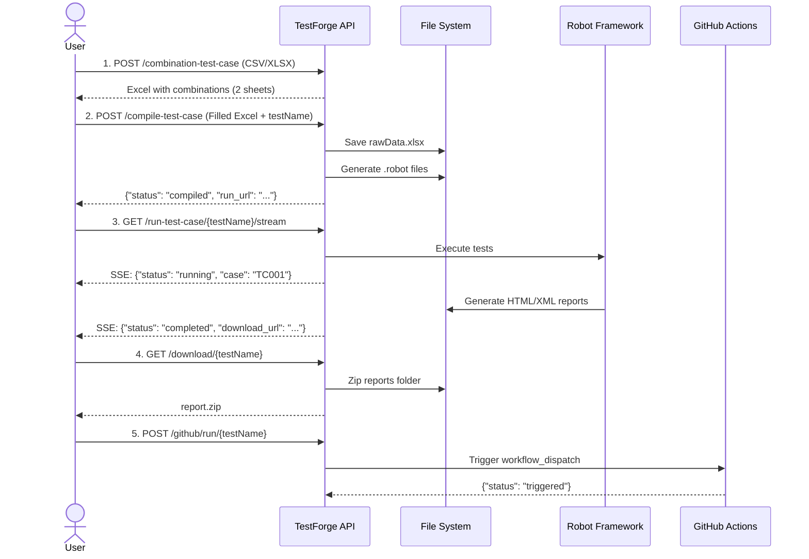

# 🧪 TestForge

**Automated Combination → Compilation → Execution → Reporting Platform for Robot Framework**

[](https://www.python.org/downloads/)
[](https://fastapi.tiangolo.com/)
[](https://robotframework.org/)
[](https://github.com/Baipo-Production/test-forge/actions/workflows/api-integration-test.yml)

---

## 📋 Table of Contents

- [Overview](#-overview)
- [Features](#-features)
- [Architecture](#-architecture)
- [Project Structure](#-project-structure)
- [Prerequisites](#-prerequisites)
- [Installation](#-installation)
  - [macOS Setup](#macos-setup)
  - [Windows Setup](#windows-setup)
- [Running the Application](#-running-the-application)
  - [Development Mode](#development-mode)
  - [Docker Mode](#docker-mode)
- [API Endpoints](#-api-endpoints)
- [Workflow](#-workflow)
- [GitHub Actions Integration](#-github-actions-integration)
- [Environment Variables](#-environment-variables)
- [Testing](#-testing)
- [Troubleshooting](#-troubleshooting)

---

## 🎯 Overview

**TestForge** is an end-to-end test automation platform that transforms test case combinations into executable Robot Framework tests with real-time execution monitoring and comprehensive reporting.

### **Key Capabilities:**
1. **Generate Test Combinations** from CSV/Excel input
2. **Compile Test Cases** into Robot Framework scripts
3. **Execute Tests** with real-time SSE (Server-Sent Events) streaming
4. **Download Reports** as zipped artifacts
5. **GitHub Actions Integration** for CI/CD workflows

---

## ✨ Features

- ✅ **Test Combination Generator** — Upload CSV/XLSX files and auto-generate test case combinations
- ✅ **Smart Robot Framework Compilation** — Auto-detect base URLs, convert full URLs to relative paths, and generate clean `.robot` test files
- ✅ **Comprehensive Request/Response Logging** — Every test case logs full request details (method, endpoint, headers, body) and response data (status, headers, body) for easy debugging
- ✅ **Real-Time Execution Streaming** — Monitor test progress via Server-Sent Events (SSE)
- ✅ **Report Download** — Zip and download test execution reports with detailed logs
- ✅ **GitHub Actions Trigger** — Re-run tests in CI/CD pipelines via API
- ✅ **Docker Support** — Containerized deployment with `docker-compose`
- ✅ **Async File I/O** — High-performance file handling with `aiofiles`

---

## 🏗️ Architecture

```mermaid
graph TB
    Client[Client/Browser] -->|1. Upload CSV/XLSX| API[FastAPI Server]
    API -->|2. Generate Combinations| Combo[Combination Service]
    Combo -->|Excel with 2 sheets| Client
    
    Client -->|3. Upload Filled Excel| API
    API -->|4. Compile to .robot| Compile[Compile Service]
    Compile -->|Save to workspace/{testName}/| FS[File System]
    
    Client -->|5. Start Execution Stream| API
    API -->|6. Run Robot Tests| Run[Run Service]
    Run -->|7. Stream SSE Events| Client
    Run -->|8. Generate Reports| FS
    
    Client -->|9. Download Report| API
    API -->|10. Zip & Return| Download[Download Service]
    
    Client -->|11. Trigger CI/CD| API
    API -->|12. Workflow Dispatch| GH[GitHub Actions]
    
    style API fill:#009688,color:#fff
    style Client fill:#2196F3,color:#fff
    style FS fill:#FF9800,color:#fff
    style GH fill:#673AB7,color:#fff
```

---

## 📂 Project Structure

```
TestForge/
├── 📁 app/
│   ├── main.py                    # FastAPI application entry point
│   ├── 📁 core/
│   │   ├── config.py              # Environment configuration
│   │   ├── utils_io.py            # File I/O utilities
│   │   ├── utils_sse.py           # Server-Sent Events utilities
│   │   └── utils_zip.py           # Zip compression utilities
│   ├── 📁 routers/
│   │   ├── combination_router.py  # POST /api/v1/combination-test-case
│   │   ├── compile_router.py      # POST /api/v1/compile-test-case
│   │   ├── run_router.py          # GET  /api/v1/run-test-case/{testName}/stream
│   │   ├── download_router.py     # GET  /api/v1/download/{testName}
│   │   └── github_router.py       # POST /api/v1/github/run/{testName}
│   ├── 📁 schemas/
│   │   ├── compile_request.py     # Pydantic models for compilation
│   │   └── test_summary.py        # Test result schemas
│   └── 📁 services/
│       ├── combination_service.py # Test combination logic
│       ├── compile_service.py     # Robot Framework generation
│       ├── run_service.py         # Test execution engine
│       ├── download_service.py    # Report packaging
│       └── github_service.py      # GitHub API integration
├── 📁 tests/
│   └── test_smoke.py              # Smoke tests
├── 📁 workspace/                  # Auto-generated test workspaces
│   └── {testName}/
│       ├── rawData.xlsx           # Original test data
│       ├── generated/             # .robot files
│       └── reports/               # HTML/XML reports
├── docker-compose.yml             # Docker orchestration
├── Dockerfile                     # Container image definition
├── requirements.txt               # Python dependencies
└── README.md                      # This file
```

---

## 🔧 Prerequisites

Before installing TestForge, ensure you have:

- **Python 3.14.0** (required)
- **pip** (comes with Python)
- **Git** (for cloning the repository)
- **Docker & Docker Compose** (optional, for containerized deployment)

---

## 📦 Installation

### **macOS Setup**

#### 1. Install Python 3.14.0

```bash
# Using Homebrew (recommended)
brew install python@3.14

# Verify installation
python3.14 --version  # Should output: Python 3.14.0
```

Or download from [python.org/downloads](https://www.python.org/downloads/)

#### 2. Clone the Repository

```bash
git clone https://github.com/yourusername/TestForge.git
cd TestForge
```

#### 3. Create Virtual Environment

```bash
# Create virtual environment
python3.14 -m venv venv

# Activate virtual environment
source venv/bin/activate

# Verify Python version inside venv
python --version  # Should show Python 3.14.0
```

#### 4. Install Dependencies

```bash
pip install --upgrade pip
pip install -r requirements.txt
```

#### 5. Verify Installation

```bash
python -c "import fastapi; import pandas; import robot; print('✅ All dependencies installed!')"
```

---

### **Windows Setup**

#### 1. Install Python 3.14.0

**Option A: Download Installer**
1. Go to [python.org/downloads](https://www.python.org/downloads/)
2. Download **Python 3.14.0** for Windows
3. Run the installer
4. ✅ **Check "Add Python 3.14 to PATH"**
5. Click "Install Now"

**Option B: Using Windows Package Manager (winget)**
```powershell
winget install Python.Python.3.14
```

**Verify Installation:**
```powershell
python --version  # Should output: Python 3.14.0
```

#### 2. Clone the Repository

```powershell
git clone https://github.com/yourusername/TestForge.git
cd TestForge
```

#### 3. Create Virtual Environment

```powershell
# Create virtual environment
python -m venv venv

# Activate virtual environment
.\venv\Scripts\Activate.ps1

# If you get execution policy error, run:
# Set-ExecutionPolicy -ExecutionPolicy RemoteSigned -Scope CurrentUser

# Verify Python version inside venv
python --version  # Should show Python 3.14.0
```

#### 4. Install Dependencies

```powershell
python -m pip install --upgrade pip
pip install -r requirements.txt
```

#### 5. Verify Installation

```powershell
python -c "import fastapi; import pandas; import robot; print('✅ All dependencies installed!')"
```

---

## 🚀 Running the Application

### **Development Mode**

#### macOS / Linux
```bash
# Activate virtual environment (if not already active)
source venv/bin/activate

# Run the server
uvicorn app.main:app --host 0.0.0.0 --port 3000 --reload
```

#### Windows
```powershell
# Activate virtual environment (if not already active)
.\venv\Scripts\Activate.ps1

# Run the server
uvicorn app.main:app --host 0.0.0.0 --port 3000 --reload
```

**Access the API:**
- 🌐 **Swagger UI:** http://localhost:3000/docs
- 📚 **ReDoc:** http://localhost:3000/redoc

---

### **Docker Mode**

#### 1. Build and Run with Docker Compose

```bash
# Build image
docker-compose build

# Start service
docker-compose up -d

# View logs
docker-compose logs -f testforge-api
```

#### 2. Access the API

- 🌐 **Swagger UI:** http://localhost:3000/docs

#### 3. Stop the Service

```bash
docker-compose down
```

---

## 📡 API Endpoints

### **Workflow Overview**



---

### **1. Download Example Template**

**Endpoint:** `GET /api/v1/download/example-combination-data`

**Description:** Download example Excel template with sample data and comprehensive prefix documentation.

**Request:**
```bash
curl -OJ http://localhost:3000/api/v1/download/example-combination-data
```

**Response:** `example-combination-data.xlsx` with 2 sheets:
- **Sheet 1 (combination-data):** Sample test data with examples of all prefix types
- **Sheet 2 (note):** Complete documentation of all available prefixes:
  - `[API]endpoint` - API endpoint URL
  - `[API]Method` - HTTP method (GET, POST, PUT, DELETE)
  - `[Request][Header]<name>` - Request headers
  - `[Request][Params]<name>` - Path parameters (reserved)
  - `[Request][Query]<name>` - Query string parameters
  - `[Request][Body]<field>` - Request body fields
  - `[Request][Body]<parent>.<child>` - Nested objects (dot notation)
  - `[Request][Body]<array>[<index>].<field>` - Array elements (bracket notation)
  - `[Response][API]status` - Expected HTTP status code
  - `[Response][Body]<json-path>` - Expected response body values (supports operators)
  - `[Response][Body]<json-path>:<operator>` - Dynamic assertions with operators
  - `[Response][Body]<json-path>:<operator>[Type:<type>]` - With explicit data type casting
  - `[Response][Header]<name>` - Expected response headers

**Supported Assertion Operators:**

**Comparison Operators:**
- `eq` (default) — Exact equality check
- `ne` — Not equal
- `gt` — Greater than (numeric)
- `lt` — Less than (numeric)
- `between` — Numeric range check; use cell value like `low,high` (e.g., `50,80`)

**String Operators:**
- `contains` — Substring present
- `regex` — Regular expression match

**Type & Structure Validation:**
- `is_null` — Field value is `null`
- `is_not_null` — Field value is not `null`
- `is_empty` — String/array/object is empty (`""`, `[]`, `{}`)
- `is_not_empty` — String/array/object is not empty
- `is_array` — Field is a JSON array
- `is_object` — Field is a JSON object
- `is_string` — Field is a string
- `is_number` — Field is a number
- `is_bool` — Field is a boolean

**Supported Data Types (optional):**
- `[Type:int]` or `[Type:integer]` — Integer numbers
- `[Type:float]` or `[Type:number]` — Floating-point numbers
- `[Type:bool]` or `[Type:boolean]` — Boolean values (true/false)
- `[Type:string]` — String values (default)

**Sentinel Keywords (Special Values):**

TestForge supports special keywords for edge case testing:

| Keyword | Generated Value | Use Case |
|---------|----------------|----------|
| `[EMPTY]` or `[EMPTY_STRING]` | `""` | Send empty string explicitly |
| `[NULL]` | `null` | Send JSON null value |
| `[EMPTY_ARRAY]` | `[]` | Send empty array |
| `[EMPTY_OBJECT]` | `{}` | Send empty object |
| (blank cell) | field omitted | Don't send field at all |

**Sentinel Keyword Examples:**

*Request Examples:*
```excel
| [Request][Body]name | [Request][Body]age | [Request][Body]tags | [Request][Body]meta |
|---------------------|-------------------|---------------------|---------------------|
| [EMPTY]             | [NULL]            | [EMPTY_ARRAY]       | [EMPTY_OBJECT]      |
```
→ Generates request body:
```json
{
  "name": "",
  "age": null,
  "tags": [],
  "meta": {}
}
```

*Response Validation Examples:*
```excel
| [Response][Body]error:is_null | [Response][Body]items:is_empty | [Response][Body]data:is_not_null |
|-------------------------------|-------------------------------|----------------------------------|
| true                          | true                          | true                             |
```
→ Validates:
- `error` field is `null`
- `items` array is empty `[]`
- `data` field exists and is not `null`

**Basic Examples:**
- `[Response][Body]id` with value `123` → equality check (string)
- `[Response][Body]age:gt[Type:int]` with value `18` → checks age > 18 (integer)
- `[Response][Body]score:between[Type:float]` with value `50.5,80.9` → checks 50.5 ≤ score ≤ 80.9
- `[Response][Body]active[Type:bool]` with value `true` → checks boolean equality
- `[Response][Body]name:contains` with value `John` → checks if name contains "John"
- `[Response][Header]Content-Type:regex` with value `^application/json` → regex match

**Advanced Examples:**
- `[Request][Body]email` with `[EMPTY]` → sends `{"email": ""}`
- `[Request][Body]address` with `[NULL]` → sends `{"address": null}`
- `[Response][Body]profile.address:is_null` with `true` → validates nested null value
- `[Response][Body]items:is_array` with `true` → validates field is array
- `[Response][Body]metadata:is_empty` with `true` → validates empty object/string/array

---

### **2. Generate Test Combinations**

**Endpoint:** `POST /api/v1/combination-test-case`

**Description:** Upload a CSV or XLSX file to generate test case combinations.

**Request:**
```bash
curl -X POST http://localhost:3000/api/v1/combination-test-case \
  -F "file=@input.xlsx"
```

**Response:** Excel file with 2 sheets:
- **Sheet 1 (combination):** Generated test case combinations (Cartesian product)
- **Sheet 2 (note):** Instructions and prefix documentation (same as example template)

**Note:** After downloading, manually add `[Response]` columns to define expected results.

---

### **3. Compile Test Cases**

**Endpoint:** `POST /api/v1/compile-test-case`

**Description:** Upload filled Excel file to generate Robot Framework `.robot` files.

**Request:**
```bash
curl -X POST http://localhost:3000/api/v1/compile-test-case \
  -F "file=@testcases.xlsx" \
  -F "testName=MyTestSuite"
```

**Response:**
```json
{
  "status": "compiled",
  "testName": "MyTestSuite",
  "cases": 15,
  "run_url": "/api/v1/run-test-case/MyTestSuite/stream"
}
```

**File Structure Created:**
```
workspace/
└── MyTestSuite/
    ├── rawData.xlsx
    ├── generated/
    │   ├── TC_001.robot
    │   ├── TC_002.robot
    │   └── ...
    └── Report/  (created after execution)
```

**Generated Robot File Features:**
- ✅ Auto-detects base URL from endpoint (e.g., `http://mockoon.ariyanaragroup.com`)
- ✅ Converts full URLs to relative paths (e.g., `/api/v1/public/home`)
- ✅ Only creates variables when data exists (no empty dictionaries)
- ✅ Uses `json=` parameter for request bodies
- ✅ Logs complete request and response details with `console=yes` for visibility
- ✅ **Accepts all HTTP status codes** with `expected_status=any` — prevents RequestsLibrary from raising HTTPError on 4xx/5xx responses, allowing tests to validate expected error codes properly

---

### **4. Run Tests (with SSE Streaming)**

**Endpoint:** `GET /api/v1/run-test-case/{testName}/stream`

**Description:** Execute Robot Framework tests with real-time progress updates.

**Request:**
```bash
curl -N http://localhost:3000/api/v1/run-test-case/MyTestSuite/stream
```

**Response (SSE Stream):**
```
data: {"status": "running", "case": "TC001", "progress": 10}

data: {"status": "passed", "case": "TC001", "progress": 20}

data: {"status": "running", "case": "TC002", "progress": 30}

data: {"status": "completed", "download_url": "http://localhost:3000/api/v1/download/MyTestSuite"}
```

**JavaScript Example (Frontend):**
```javascript
const eventSource = new EventSource('/api/v1/run-test-case/MyTestSuite/stream');

eventSource.onmessage = (event) => {
  const data = JSON.parse(event.data);
  console.log(`Status: ${data.status}, Progress: ${data.progress}%`);
  
  if (data.status === 'completed') {
    console.log(`Download report: ${data.download_url}`);
    eventSource.close();
  }
};
```

---

### **5. Download Test Report**

**Endpoint:** `GET /api/v1/download/{testName}`

**Description:** Download zipped test execution reports.

**Request:**
```bash
curl -OJ http://localhost:3000/api/v1/download/MyTestSuite
```

**Response:** `MyTestSuite_report.zip` containing:
- `log.html` — Detailed execution log
- `report.html` — Test report with statistics
- `output.xml` — Machine-readable results

---

### **6. Trigger GitHub Actions**

**Endpoint:** `POST /api/v1/github/run/{testName}`

**Description:** Trigger workflow_dispatch event in GitHub Actions.

**Request:**
```bash
curl -X POST http://localhost:3000/api/v1/github/run/MyTestSuite
```

**Response:**
```json
{
  "status": "triggered",
  "testName": "MyTestSuite",
  "workflow": "test-execution.yml"
}
```

---

## 📝 Quick Start Guide

1. **Download example template**
   ```bash
   curl -OJ http://localhost:3000/api/v1/download/example-combination-data
   ```

2. **Customize the template** with your API test data (or generate combinations from your own file)

3. **Generate combinations** (optional if you already have complete data)
   ```bash
   curl -X POST http://localhost:3000/api/v1/combination-test-case -F "file=@your-data.xlsx"
   ```

4. **Add expected results** - Fill in `[Response]` columns in the Excel file

5. **Compile tests**
   ```bash
   curl -X POST http://localhost:3000/api/v1/compile-test-case \
     -F "testName=MyTest" -F "file=@filled-data.xlsx"
   ```

6. **Run tests** - Visit `http://localhost:3000/docs` and use the stream endpoint

7. **Download reports** - Get the ZIP file with all test results

---

## ⚙️ Environment Variables

Create a `.env` file in the project root:

```bash
# Storage Configuration
STORAGE_PATH=./workspace

# Logging
LOG_LEVEL=INFO

# GitHub Integration (Optional)
GITHUB_REPOSITORY=owner/TestForge
GITHUB_TOKEN=ghp_xxxxxxxxxxxxxxxxxxxx
```

**Environment Variables:**

| Variable | Description | Default | Required |
|----------|-------------|---------|----------|
| `STORAGE_PATH` | Directory for test workspaces | `./workspace` | No |
| `LOG_LEVEL` | Logging level (DEBUG/INFO/WARNING/ERROR) | `INFO` | No |
| `GITHUB_REPOSITORY` | GitHub repo (format: `owner/repo`) | `owner/TestForge` | No |
| `GITHUB_TOKEN` | GitHub Personal Access Token | — | Yes (for GitHub features) |

---

## 🧪 Testing

### Run Smoke Tests

```bash
# Activate virtual environment
source venv/bin/activate  # macOS/Linux
.\venv\Scripts\Activate.ps1  # Windows

# Run tests
pytest tests/test_smoke.py -v
```

### Manual API Testing

Use the interactive API documentation:
- **Swagger UI:** http://localhost:3000/docs
- **ReDoc:** http://localhost:3000/redoc

---

## 🐛 Troubleshooting

### **Issue: Python 3.14 not found**

**Solution:**
```bash
# macOS
brew install python@3.14

# Windows
winget install Python.Python.3.14

# Verify
python --version
```

---

### **Issue: Virtual environment activation fails on Windows**

**Error:**
```
execution of scripts is disabled on this system
```

**Solution:**
```powershell
Set-ExecutionPolicy -ExecutionPolicy RemoteSigned -Scope CurrentUser
```

---

### **Issue: Port 3000 already in use**

**Solution:**
```bash
# Change port in command
uvicorn app.main:app --host 0.0.0.0 --port 8080 --reload
```

Or kill the process:
```bash
# macOS/Linux
lsof -ti:3000 | xargs kill -9

# Windows
netstat -ano | findstr :3000
taskkill /PID <PID> /F
```

---

### **Issue: Docker build fails**

**Solution:**
```bash
# Clean rebuild
docker-compose down -v
docker-compose build --no-cache
docker-compose up -d
```

---

### **Issue: Robot Framework tests fail**

**Check:**
1. Verify `.robot` files exist in `workspace/{testName}/generated/`
2. Check `rawData.xlsx` format matches expected schema
3. Review logs: `docker-compose logs -f testforge-api`
4. **Enable detailed logging:** All test cases automatically log request/response details with `console=yes` flag
5. **Check report logs:** Open `log.html` in the Report folder to see full request/response data
6. **Common issues:**
   - Missing base URL → Check that `[API]endpoint` contains full URL in first row
   - Variable not found errors → Ensure compile service only creates variables when data exists
   - **HTTPError on expected error codes** → Fixed! All generated tests now use `expected_status=any` to accept any HTTP status code (200, 400, 500, etc.) and validate it properly with assertions

**Example Generated Test Case:**
```robot
*** Test Cases ***
TC_044
    ${headers}=    Create Dictionary    x-mock-status=400
    ${payload}=    Create Dictionary    Gender=Female    Age=18-30
    ${resp}=    POST On Session    api    /api/combination-data    headers=${headers}    json=${payload}    expected_status=any
    Should Be Equal As Integers    ${resp.status_code}    400
```

The `expected_status=any` parameter ensures that RequestsLibrary does not raise an exception when the API returns error status codes (4xx, 5xx), allowing the test to proceed and validate the actual status code.

---

## 🤖 GitHub Actions Integration

TestForge provides **comprehensive CI/CD integration** with GitHub Actions for automated testing workflows.

### **📋 Available Workflows**

#### **1. Full Integration Test** (Recommended)
**File:** `.github/workflows/api-integration-test.yml`

Complete end-to-end test pipeline covering all 5 actions:
1. Download example template
2. Generate test combinations
3. Compile to Robot Framework
4. Run tests with SSE streaming
5. Download test reports

**Triggers:**
- ✅ Manual (workflow_dispatch)
- ✅ Push to `master` (when `app/**` changes)
- ✅ Pull requests to `master`

**Quick Start:**
```bash
# Via GitHub CLI
gh workflow run api-integration-test.yml \
  -f testName=my-test-suite \
  -f inputFile=data/custom-input.xlsx

# Via GitHub UI
# Actions → "TestForge API Integration Test" → Run workflow
```

**Inputs:**
- `testName` (optional): Test suite name, default: `github-action-test`
- `inputFile` (optional): Path to input file, default: uses example template

**Artifacts:** All generated files, logs, and reports (30 days retention)

---

#### **2. Individual Action Workflows**

For granular control, run each action separately:

| Workflow | File | Purpose | Usage |
|----------|------|---------|-------|
| **Download Example** | `action-1-download-example.yml` | Get example template | `gh workflow run action-1-download-example.yml` |
| **Generate Combinations** | `action-2-combination.yml` | Create test combinations | `gh workflow run action-2-combination.yml -f inputFile=data/input.xlsx` |
| **Compile Tests** | `action-3-compile.yml` | Build Robot Framework tests | `gh workflow run action-3-compile.yml -f testName=suite -f inputFile=data/filled.xlsx` |
| **Run Tests (Stream)** | `action-4-run-stream.yml` | Execute with SSE output | `gh workflow run action-4-run-stream.yml -f testName=suite` |
| **Download Report** | `action-5-download-report.yml` | Get test reports | `gh workflow run action-5-download-report.yml -f testName=suite` |

---

### **🚀 Common Use Cases**

#### **Example 1: Auto-Test on Push**
```bash
# Any push to master with changes in app/ triggers full integration test
git add app/
git commit -m "Update API logic"
git push origin master

# Workflow runs automatically with default settings
# View results: https://github.com/{owner}/{repo}/actions
```

#### **Example 2: Manual Full Pipeline**
```bash
# Run complete test pipeline with custom inputs
gh workflow run api-integration-test.yml \
  -f testName=staging-smoke-test \
  -f inputFile=data/staging-tests.xlsx

# Monitor progress
gh run watch

# Download artifacts after completion
gh run list --workflow=api-integration-test.yml --limit 1
gh run download <RUN_ID>
```

#### **Example 3: Step-by-Step Testing**
```bash
# Step 1: Download template
gh workflow run action-1-download-example.yml

# Step 2: Generate combinations (after filling input file)
gh workflow run action-2-combination.yml -f inputFile=data/my-tests.xlsx

# Step 3: Compile (after filling response columns)
gh workflow run action-3-compile.yml \
  -f testName=api-regression \
  -f inputFile=data/filled-tests.xlsx

# Step 4: Run tests
gh workflow run action-4-run-stream.yml -f testName=api-regression

# Step 5: Download report
gh workflow run action-5-download-report.yml \
  -f testName=api-regression \
  -f timestamp=20251030_143022
```

---

### **📊 Monitoring & Artifacts**

**View Workflow Runs:**
```bash
# List recent runs
gh run list --workflow=api-integration-test.yml

# View specific run details
gh run view <RUN_ID>

# Download all artifacts
gh run download <RUN_ID>
```

**Artifact Retention:**
- Main integration test: **30 days**
- Individual actions: **7-30 days** (varies by workflow)

**Available Artifacts:**
- Example templates (`.xlsx`)
- Generated combinations (`.xlsx`)
- Compiled test data (`.xlsx`)
- Robot Framework test files (`.robot`)
- Execution logs (`.log`)
- Test reports (`.zip` with HTML/XML)
- Server logs (`.log`)

---

### **🔍 Troubleshooting GitHub Actions**

#### **Server fails to start**
- Check `server.log` in artifacts
- Verify Python 3.14.0 compatibility
- Review dependency installation logs

#### **Health check timeout**
- Increase timeout in workflow (default: 60s)
- Check for port conflicts (port 3000)
- Review server startup logs

#### **File not found**
- Ensure `inputFile` path is **relative to repo root**
- Verify file exists in repository
- Check Git LFS for large files

#### **Compilation errors**
- Validate input file format (CSV/XLSX)
- Check required columns: `[API]`, `[Request]`, `[Response]`
- Review `compile_response.json` in artifacts

#### **Test execution fails**
- Review SSE stream output (`sse_output.log`)
- Check API endpoint accessibility from GitHub Actions runners
- Verify test data format matches schema

---

### **📚 Detailed Documentation**

For comprehensive GitHub Actions documentation, see:
- **Workflow Guide:** [`.github/workflows/README.md`](.github/workflows/README.md)
- **GitHub Actions Docs:** https://docs.github.com/en/actions

---

## 📄 License

This project is licensed under the MIT License.

---

## 🤝 Contributing

Contributions are welcome! Please:

1. Fork the repository
2. Create a feature branch (`git checkout -b feature/amazing-feature`)
3. Commit your changes (`git commit -m 'Add amazing feature'`)
4. Push to the branch (`git push origin feature/amazing-feature`)
5. Open a Pull Request

---

## 📞 Support

For issues or questions:
- 📧 Email: support@testforge.io
- 🐛 Issues: [GitHub Issues](https://github.com/yourusername/TestForge/issues)

---

**Built with ❤️ using Python 3.14, FastAPI, and Robot Framework**
